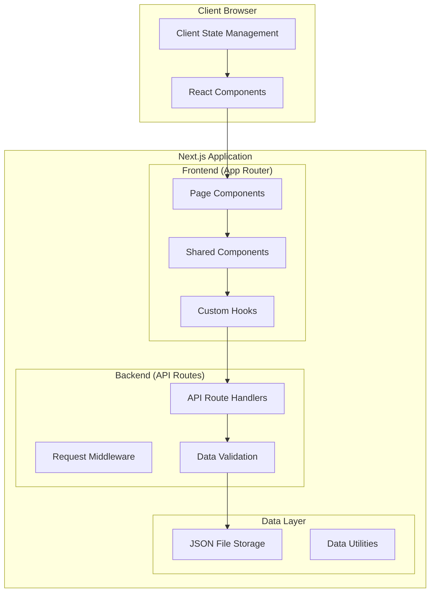

# Design Document: Catalog Management System

## Overview

The Catalog Management System is a full-stack Next.js application that provides a modern, responsive interface for browsing and managing product catalogs. The system leverages Next.js 14's App Router architecture to create both frontend pages and backend API routes within a single application, eliminating the need for a separate backend server.

The design emphasizes simplicity, performance, and maintainability while providing a rich user experience for both catalog browsing and administrative functions.

## Architecture

### High-Level Architecture



### Technology Stack

- **Frontend Framework**: Next.js 14 with App Router
- **UI Library**: React 19 with TypeScript/JSX
- **Styling**: Tailwind CSS 4
- **State Management**: React useState and useEffect hooks
- **Data Storage**: JSON file-based storage
- **HTTP Client**: Native fetch API
- **Development Tools**: ESLint for code quality

### Deployment Architecture

The application follows a monolithic architecture where both frontend and backend logic coexist within the Next.js framework. This approach provides several benefits:

- **Simplified Deployment**: Single application deployment
- **Shared Code**: Common utilities and types between frontend and backend
- **Development Efficiency**: Unified development environment
- **Performance**: Optimized bundling and server-side rendering

## Components and Interfaces

### Frontend Components

#### Core Page Components

**HomePage (`src/app/page.jsx`)**
- Landing page with hero section and feature highlights
- Navigation to catalog and authentication pages
- Responsive design with dark mode support

**ItemsPage (`src/app/items/page.jsx`)**
- Product grid display with search and filtering
- Server-side data fetching for initial load
- Real-time filtering and search functionality

**ItemDetailPage (`src/app/items/[id]/page.jsx`)**
- Detailed product view with images and specifications
- Dynamic routing based on product ID
- Related product recommendations

**AddItemPage (`src/app/add-item/page.jsx`)**
- Product creation form with validation
- Image upload functionality
- Success/error state management

**LoginPage (`src/app/login/page.jsx`)**
- Authentication form with credential validation
- Session management and redirect logic
- Demo credentials for testing

#### Shared Components

**Navbar (`src/components/Navbar.jsx`)**
- Site navigation with authentication state
- Responsive mobile menu
- Dark mode toggle

**Footer (`src/components/Footer.jsx`)**
- Site footer with links and information
- Consistent styling across pages

#### Custom Hooks

**useProductSearch**
```javascript
const useProductSearch = (products, searchTerm, category) => {
  const [filteredProducts, setFilteredProducts] = useState(products);
  
  useEffect(() => {
    // Filter logic implementation
  }, [products, searchTerm, category]);
  
  return filteredProducts;
};
```

**useAuth**
```javascript
const useAuth = () => {
  const [isAuthenticated, setIsAuthenticated] = useState(false);
  
  // Authentication state management
  return { isAuthenticated, login, logout };
};
```

### Backend API Routes

#### Product Management API

**GET `/api/products`**
- Returns all products with optional filtering
- Supports query parameters for search and category filtering
- Response format: `{ products: Product[], total: number }`

**POST `/api/products`**
- Creates new product with validation
- Handles image upload and storage
- Returns created product or validation errors

**GET `/api/products/[id]`**
- Returns specific product by ID
- Includes related product suggestions
- 404 handling for non-existent products

**PUT `/api/products/[id]`**
- Updates existing product (admin only)
- Partial update support
- Validation and error handling

**DELETE `/api/products/[id]`**
- Removes product from catalog (admin only)
- Cascade deletion of associated images
- Soft delete option for data retention

#### Authentication API

**POST `/api/auth/login`**
- Validates user credentials
- Sets authentication cookies
- Returns user session information

**POST `/api/auth/logout`**
- Clears authentication session
- Invalidates tokens
- Redirects to login page

**GET `/api/auth/session`**
- Returns current authentication status
- Used for protected route validation
- Session refresh logic

### API Response Formats

#### Success Response
```json
{
  "success": true,
  "data": { /* response data */ },
  "message": "Operation completed successfully"
}
```

#### Error Response
```json
{
  "success": false,
  "error": {
    "code": "VALIDATION_ERROR",
    "message": "Invalid input data",
    "details": { /* field-specific errors */ }
  }
}
```

## Data Models

### Product Model

```typescript
interface Product {
  id: string;                    // Unique identifier (UUID or timestamp-based)
  name: string;                  // Product name (required, 1-200 characters)
  description: string;           // Product description (required, 1-2000 characters)
  price: number;                 // Price in USD (required, positive number)
  category: string;              // Product category (required, predefined list)
  condition: ProductCondition;   // Product condition enum
  images: string[];              // Array of image URLs/paths
  brand?: string;                // Optional brand name
  specifications?: Record<string, any>; // Optional key-value specifications
  tags?: string[];               // Optional search tags
  createdAt: Date;               // Creation timestamp
  updatedAt: Date;               // Last modification timestamp
  isActive: boolean;             // Soft delete flag
}

enum ProductCondition {
  NEW = "new",
  LIKE_NEW = "like-new", 
  GOOD = "good",
  FAIR = "fair",
  POOR = "poor"
}
```

### User Model

```typescript
interface User {
  id: string;                    // Unique identifier
  email: string;                 // Email address (unique)
  passwordHash: string;          // Hashed password
  role: UserRole;                // User role enum
  createdAt: Date;               // Account creation date
  lastLoginAt?: Date;            // Last login timestamp
  isActive: boolean;             // Account status
}

enum UserRole {
  ADMIN = "admin",
  USER = "user"
}
```

### Session Model

```typescript
interface Session {
  id: string;                    // Session identifier
  userId: string;                // Associated user ID
  expiresAt: Date;               // Session expiration
  createdAt: Date;               // Session creation time
}
```

## Data Storage Strategy

### File-Based JSON Storage

The application uses a simple file-based storage system for development and small-scale deployment:

**Storage Structure:**
```
data/
├── products.json              // Product catalog data
├── users.json                 // User account data
├── sessions.json              // Active sessions
└── uploads/                   // Product images
    └── products/
        ├── {product-id}/
        │   ├── image1.jpg
        │   └── image2.jpg
```

**Data Access Layer:**
```javascript
class DataStore {
  async getProducts(filters = {}) {
    // Read and filter products from JSON file
  }
  
  async saveProduct(product) {
    // Validate and save product to JSON file
  }
  
  async deleteProduct(id) {
    // Remove product from JSON file
  }
}
```

### Data Persistence Features

- **Atomic Writes**: Use temporary files and atomic rename operations
- **Backup Strategy**: Automatic daily backups of data files
- **Data Validation**: Schema validation before persistence
- **Concurrent Access**: File locking for concurrent operations
- **Migration Support**: Version-based data migration system

## Error Handling

### Frontend Error Handling

**Component Error Boundaries:**
```javascript
class ProductErrorBoundary extends React.Component {
  constructor(props) {
    super(props);
    this.state = { hasError: false };
  }
  
  static getDerivedStateFromError(error) {
    return { hasError: true };
  }
  
  render() {
    if (this.state.hasError) {
      return <ErrorFallback />;
    }
    return this.props.children;
  }
}
```

**API Error Handling:**
- Network error retry logic with exponential backoff
- User-friendly error messages for common scenarios
- Loading states and error boundaries for async operations
- Form validation with real-time feedback

### Backend Error Handling

**Global Error Handler:**
```javascript
export function handleApiError(error, req, res) {
  console.error('API Error:', error);
  
  if (error.name === 'ValidationError') {
    return res.status(400).json({
      success: false,
      error: {
        code: 'VALIDATION_ERROR',
        message: error.message,
        details: error.details
      }
    });
  }
  
  // Handle other error types...
}
```

**Error Categories:**
- **Validation Errors**: Input data validation failures
- **Authentication Errors**: Login and authorization failures  
- **Not Found Errors**: Resource not found scenarios
- **Server Errors**: Internal application errors
- **Rate Limiting**: Request throttling and abuse prevention

## Testing Strategy

### Unit Testing Approach

The testing strategy employs both traditional unit tests and property-based tests to ensure comprehensive coverage and correctness validation.

**Unit Tests Focus Areas:**
- Component rendering and user interactions
- API route handlers and business logic
- Data validation and transformation utilities
- Error handling and edge cases
- Authentication and authorization flows

**Property-Based Tests Focus Areas:**
- Data model validation across all possible inputs
- Search and filtering logic correctness
- API response format consistency
- State management invariants

### Testing Framework Configuration

**Frontend Testing:**
- **Framework**: Jest with React Testing Library
- **Component Testing**: Render testing and user interaction simulation
- **Integration Testing**: API integration and data flow validation

**Backend Testing:**
- **Framework**: Jest with Supertest for API testing
- **Property Testing**: fast-check library for property-based testing
- **Database Testing**: In-memory JSON storage for test isolation

**Property-Based Test Configuration:**
- Minimum 100 iterations per property test
- Custom generators for domain-specific data types
- Shrinking enabled for minimal counterexample discovery
- Test tagging format: `Feature: catalog-management-system, Property {number}: {description}`

### Test Organization

```
tests/
├── unit/
│   ├── components/
│   ├── api/
│   └── utils/
├── integration/
│   ├── api-routes/
│   └── page-flows/
├── property/
│   ├── data-models/
│   ├── search-logic/
│   └── validation/
└── fixtures/
    ├── products.json
    └── users.json
```

## Correctness Properties

*A property is a characteristic or behavior that should hold true across all valid executions of a system—essentially, a formal statement about what the system should do. Properties serve as the bridge between human-readable specifications and machine-verifiable correctness guarantees.*

### Product Display Properties

**Property 1: Product Grid Rendering**
*For any* list of products, when rendered in the grid layout, each product should display its name, description, price, category, and image, and the total number of rendered items should equal the number of products provided.
**Validates: Requirements 1.1, 1.2**

**Property 2: Product Navigation**
*For any* product in the catalog, clicking on that product should navigate to a detail page with a URL containing the product's ID.
**Validates: Requirements 1.3**

### Search and Filtering Properties

**Property 3: Search Functionality**
*For any* collection of products and any search term, all products returned by the search should contain the search term in either their name or description (case-insensitive).
**Validates: Requirements 2.1**

**Property 4: Category Filtering**
*For any* collection of products and any category selection, all products returned by the category filter should belong to the selected category.
**Validates: Requirements 2.2**

**Property 5: Real-time Filter Updates**
*For any* filter or search criteria applied to the product grid, the displayed results should update immediately to reflect the new criteria without requiring a page refresh.
**Validates: Requirements 2.3**

**Property 6: Filter State Persistence**
*For any* search term and category filter applied, navigating away from and back to the items page should preserve the same filter state and display the same filtered results.
**Validates: Requirements 2.5**

### Product Management Properties

**Property 7: Product Creation**
*For any* valid product data submitted through the add product form, the product should be successfully created and appear in the catalog with all submitted information intact.
**Validates: Requirements 3.1**

**Property 8: Input Validation**
*For any* invalid product data (missing required fields, invalid formats, or out-of-range values), the system should prevent submission and display appropriate validation error messages.
**Validates: Requirements 3.2, 3.5**

**Property 9: Form Success State**
*For any* successful product creation, the system should display a confirmation message and reset the form to its initial empty state.
**Validates: Requirements 3.3**

**Property 10: Image Association**
*For any* product created with uploaded images, the images should be stored and correctly associated with that specific product in the catalog.
**Validates: Requirements 3.4**

### Authentication and Authorization Properties

**Property 11: Protected Route Access Control**
*For any* authenticated user, accessing protected pages should be allowed without redirection to the login page.
**Validates: Requirements 4.3**

**Property 12: Unauthenticated Access Prevention**
*For any* unauthenticated user attempting to access protected pages, the system should redirect them to the login page.
**Validates: Requirements 4.4**

**Property 13: Session Persistence**
*For any* user who logs in with "remember me" selected, closing and reopening the browser should maintain their authenticated state.
**Validates: Requirements 4.5**

### API Correctness Properties

**Property 14: Product Data API Response**
*For any* request to the products API endpoint, the response should be valid JSON containing an array of products with all required fields (id, name, description, price, category).
**Validates: Requirements 5.1**

**Property 15: Product Creation API**
*For any* valid product data submitted to the API, the product should be stored and retrievable through subsequent API calls.
**Validates: Requirements 5.2**

**Property 16: API Error Handling**
*For any* invalid data sent to the API, the response should be a properly formatted error with appropriate HTTP status codes and descriptive error messages.
**Validates: Requirements 5.3**

### Data Persistence Properties

**Property 17: Data Persistence Round Trip**
*For any* product added or modified in the system, restarting the application should preserve all changes, and the product should be retrievable with identical data.
**Validates: Requirements 6.1, 6.2**

**Property 18: Storage Error Handling**
*For any* storage operation failure, the system should handle the error gracefully, maintain system stability, and provide user notification of the failure.
**Validates: Requirements 6.3**

**Property 19: Concurrent Operation Safety**
*For any* set of concurrent product operations (create, update, delete), the final state should be consistent and no data should be corrupted or lost.
**Validates: Requirements 6.4**

**Property 20: Backup and Recovery**
*For any* product data in the system, creating a backup and then restoring from that backup should result in identical catalog contents.
**Validates: Requirements 6.5**

### Product Detail Properties

**Property 21: Complete Product Detail Display**
*For any* product in the catalog, navigating to its detail page should display all product information including images, full description, specifications, and pricing.
**Validates: Requirements 7.1, 7.2**

**Property 22: Image Navigation**
*For any* product with multiple images, the detail page should provide functional navigation controls that allow viewing all images.
**Validates: Requirements 7.3**

**Property 23: Detail Page Navigation**
*For any* product detail page, there should be functional navigation controls that return the user to the main catalog.
**Validates: Requirements 7.4**

**Property 24: Product Recommendations**
*For any* product detail page, the system should display related products that share at least one common attribute (category, brand, or price range) with the current product.
**Validates: Requirements 7.5**

### Accessibility Properties

**Property 25: Keyboard Navigation Focus**
*For any* interactive element in the system, navigating to it via keyboard should provide a visible focus indicator that meets accessibility standards.
**Validates: Requirements 8.4**